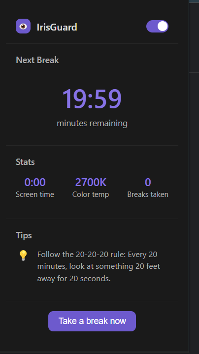
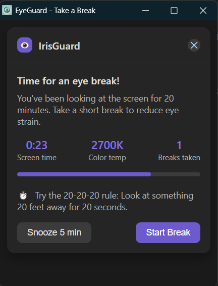
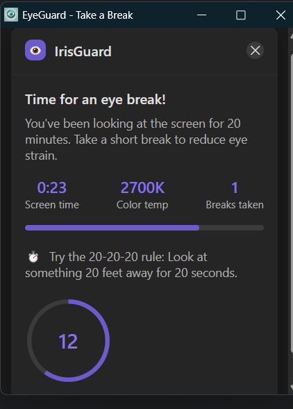

# 👁️ IrisGuard  

**IrisGuard** is a Chrome extension designed to help reduce eye strain by reminding users to take breaks at regular intervals. It follows the **20-20-20 rule**, encouraging users to look at something 20 feet away for 20 seconds every 20 minutes.  

---

## 🚀 Features  
- ⏳ **Break Reminders**: Notifies users when it's time to take a break.  
- 🔆 **Color Temperature Monitoring**: Tracks screen color temperature.  
- 📊 **Usage Stats**: Displays screen time and break history.  
- ⏰ **Customizable Timer**: Adjust break intervals as needed.  

---

## 📥 Installation Guide  

### **Method 1: Download from GitHub (Manual Installation)**  

1. **Download the Extension**  
   - Click the green **"Code"** button on the GitHub repository.  
   - Select **"Download ZIP"** and extract the files.  

2. **Load the Extension in Chrome**  
   - Open **Google Chrome** and go to `chrome://extensions/`.  
   - Enable **Developer mode** (toggle in the top-right corner).  
   - Click **"Load unpacked"** and select the extracted folder.  

3. **Start Using IrisGuard**  
   - The extension will now be available in your Chrome toolbar.  
   - Click on the **IrisGuard icon** to configure settings and track breaks.  

---

## 💡 Usage Tips  
- Follow the **20-20-20 rule**: Every **20 minutes**, look at something **20 feet away** for **20 seconds**.  
- Adjust **color temperature** settings for better eye comfort.  
- Keep track of your screen time and breaks for healthier digital habits.  

---

## 📜 License  
This project is open-source and available under the **MIT License**.  

---

## 📷 Screenshots

Here are some screenshots of the IrisGuard application:

<!-- Add more screenshots as needed -->

---

## 🤝 Contributing  
Want to improve **IrisGuard**? Feel free to contribute by submitting **pull requests** or reporting **issues** on GitHub.  

---

## 🔗 Links  

- **GitHub Repository**: [IrisGuard](https://github.com/malathi-n79/Irisguard)

